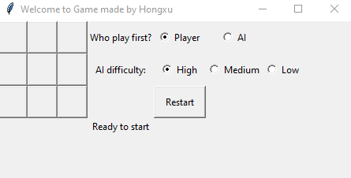
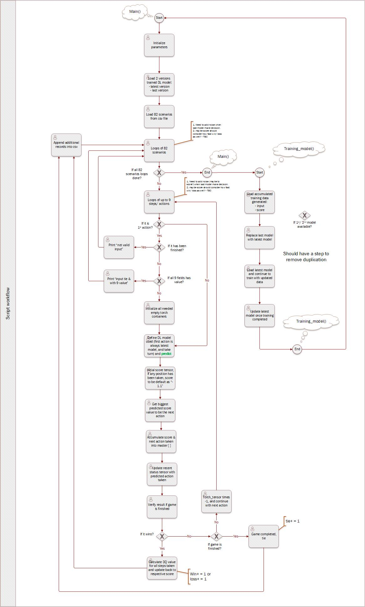

# Tic_Tac_Toe_RL
> Create a Tic Tac Toe game agent with Reinforcement Learning model. 
> For a quick introduction, you can take a look at a 2 min video here: https://www.youtube.com/watch?v=L0fXuYXd088&t

## Table of contents
* [General info](#general-info)
* [Demo](#demo)
* [Technologies](#technologies)
* [Setup](#setup)
* [Features](#features)
* [Status](#status)
* [Inspiration](#inspiration)
* [Contact](#contact)
* [Appendix](#appendix)

## General info
One dependency of machine learning supervised learning is large amount of labeled training data, sometimes it will be a bottom neck stops neural network’s performance going to next level. Introduction of Reinforcement learning enables an environment setup, with help of which model can create the training data by itself. Whole idea of Reinforcement learning simulates the way of human does, which designed to allow agent interacting with environment to gain knowledge/ agent talent. Not too difficult to understand, agent performance will not be enhanced into an expected direction without a score’s help to quantify how good/bad performance of recent game play by agent, as never forget the nature of Reinforcement learning is still supervised learning. Score acts as an exam role, of which result will become a new set training data for model to train a better performance agent next time. 

This project with the game chosen follows all terminology discussed above. Instead of computing out all combinations of game scenarios, its setups empowered a platform where allows latest trained agent to play against last version of its own. All steps will be recorded as new set of training data for further improvement. 

## Demo

## Technologies
* Python 3 - pytorch
* Python 3 - tkinter

## Setup
* Download project into local folder
* To play game against pre-trained AI, please open "Game UI.ipynb" and execute, you will see a window pops-up as per demo
* To train the Reinforcement Learning model from scratch/ last saved model, please open "RL_model.ipynb". There are few parameters inside can be setup before execution:

parameter setup:

button = 1: RL model + predict via latest model  
button = 0: Only predict via latest model  
existing setup: `button = 1`  
 
train_model_from_crash = 1: train model from scratch  
train_model_from_crash = 0: reload saved model last time and continue with training.  
existing setup: `train_model_from_crash = 0`  
 
How many Reinforcement learning loop will be trained: `main_loop_count = 20`  
Epoch size under each Reinforcement learning loop: `epoch_size = 3000`  
How many epochs to print out 1 loss: `steps_for_printing_out_loss = 1000`  
Model learning rate: `learning_rate = 0.2`  
DQ learning rate: `DQ_ratio = 0.75`  

## Features
List of features ready:
* Reinforcement Learning model, to let AI plays against last version of AI, to gain training data. Then enahnced training data will be used to continue training latest AI model.
* A simple game UI has been developed, to provide an interface for human player plays with AI model.
* Machine learning model used for this model is light level(pt model is only 24 kb), as game is not too complex, it has to be enhanced for a more complex game 

To-do list:
* Will develop a "Connect Four" game with Reinforcement learning model. Compared with this game here, game rule itself will be more fair to both players.
* Add some noise(random steps) into training output, so that AI can auto-generate more scenarios, without relying too much on initial training scenario.

## Status
Project is: _1st version completed_

## Inspiration
My insterest is in Reinforcement learning, multi-agent system and other DL related area, using project like this to practice and gain experience.

## Contact
Created by 'shaohongxu0509@gmail.com' - feel free to contact me!

## Appendix
Script workflow:
 
